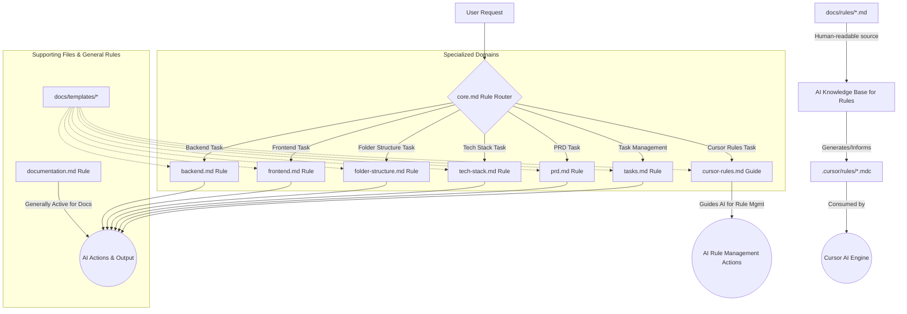

# Project-Specific Cursor AI Rules

This directory contains a set of specialized rules designed to guide the Cursor AI in assisting with various development and project management tasks for this specific project. The goal is to ensure consistency, adherence to best practices, and a streamlined AI-assisted workflow.

## Purpose

These rules serve several key purposes:

*   **Contextual Guidance:** Provide the AI with specific instructions, personas, and knowledge relevant to different aspects of the project (e.g., frontend, backend, documentation).
*   **Consistency:** Help the AI generate code, documentation, and suggestions that align with the project's established standards and conventions.
*   **Best Practices:** Embed agreed-upon best practices directly into the AI's operational guidelines for various tasks.
*   **Efficiency:** Reduce the need for repetitive manual instruction by codifying common workflows and standards for the AI.
*   **Structured Collaboration:** Define how the AI should interact with project documents (like PRDs, task lists, and tech stack documentation) and manage project artifacts.

## Rule Interaction Diagram

The primary interaction model revolves around a `core.md` rule that acts as a router, directing the AI to the appropriate specialized rule based on the user's query and context.

**Diagram Explanation:**

*   The **`core.md` Rule Router** is the entry point, analyzing user requests to activate the most relevant specialized rule.
*   **Specialized Domains** like `backend.md`, `frontend.md`, etc., provide focused instructions for that area.
*   The **`documentation.md` Rule** might be generally active or frequently invoked for documentation-related aspects across domains.
*   Various **`docs/templates/*`** support the creation of structured documents and new rules.
*   The **`cursor-rules.md` Guide** is a meta-document that instructs the AI on how to manage and create these rules.
*   Human-readable rule documentation resides in **`docs/rules/*.md`**, which informs the AI's knowledge and is used to generate the **`.cursor/rules/*.mdc`** files that the Cursor AI engine consumes.

## Directory Structure Overview

*   `docs/rules/`: Contains human-readable Markdown (`.md`) files. These are the primary source of truth for each rule's logic, persona, examples, and best practices. Rule development and understanding should start here.
*   `.cursor/rules/`: Contains the machine-readable `.mdc` files that Cursor directly consumes. These are generated/updated based on the content in `docs/rules/`.
*   `docs/templates/`: Contains various Markdown templates used for creating structured project documents (like PRDs, Task Lists, Tech Stack proposals) and for bootstrapping new Cursor rules (e.g., `cursor-rule-template.md`).

## Key Rules Overview

This project utilizes several key rules to manage different aspects of development:

*   **`core.md`**: The central router that analyzes user requests and directs the AI to the appropriate specialized rule.
*   **`documentation.md`**: Provides comprehensive guidelines for creating and maintaining all forms of project documentation (code comments, READMEs, `/docs` articles, etc.).
*   **`frontend.md`**: Guides frontend development, covering component structure, state management, styling, and framework-specific best practices (e.g., Next.js).
*   **`backend.md`**: Outlines standards for backend development, including API design, data modeling, authentication, and server-side logic.
*   **`folder-structure.md`**: Manages the project's directory layout, ensuring consistency and maintainability. It also governs the `docs/folder-structure.md` document.
*   **`tech-stack.md`**: Governs the selection, proposal, and documentation of technologies used in the project, maintaining `docs/tech-stack.md`.
*   **`prd.md`**: Provides a framework for creating and managing Product Requirements Documents, ensuring they are comprehensive and actionable.
*   **`tasks.md`**: Manages the project's task list (`docs/tasks.md`), helping to break down work, track progress, and maintain focus.
*   **`cursor-rules.md`**: A meta-guide for the AI itself on how to create, manage, and enhance all other Cursor rules within this project.

## How to Use These Rules in a New Project

While these rules are tailored for this specific project, they can serve as a robust starting point for a new project. Here's how to adapt them:

1.  **Copy the Core Structure:**
    *   Copy the `docs/rules/` directory.
    *   Copy the `.cursor/rules/` directory.
    *   Copy the `docs/templates/` directory.

2.  **Review and Adapt `core.md`:**
    *   The `core.md` (and its `.cursor/rules/core.mdc` counterpart) is the most critical piece to customize.
    *   Adjust its routing logic to match the specific domains and rules relevant to your new project. You might add, remove, or rename rule categories.

3.  **Customize Individual Rules:**
    *   Go through each `.md` file in `docs/rules/` (e.g., `frontend.md`, `backend.md`, `tech-stack.md`).
    *   **Persona:** Adjust the AI's persona if needed.
    *   **Standards & Best Practices:** Modify the specific standards, technologies, frameworks, and patterns to match your new project's choices. For example, if `frontend.md` is heavily based on Next.js and your new project uses Vue.js, you'll need significant changes.
    *   **Globs:** Update the `globs` in the frontmatter of each rule's `.mdc` file (via its `.md` source) to target the correct file paths and types in your new project.
    *   **Examples:** Update valid/invalid examples to reflect your new project's context.
    *   **Sources:** Review and update sources.

4.  **Update Corresponding `.mdc` Files:**
    *   After customizing the `.md` documentation for a rule, ensure its corresponding `.mdc` file in `.cursor/rules/` is updated to reflect these changes. The AI can assist with this.

5.  **Adapt Templates:**
    *   Review all templates in `docs/templates/` (e.g., `prd-template.md`, `tech-stack-template.md`).
    *   Customize their structure and placeholder content to fit the needs and conventions of your new project.

6.  **Create New Rules:**
    *   If your new project has areas or technologies not covered by the existing rules, create new ones.
    *   Use `docs/templates/cursor-rule-template.md` as a starting point.
    *   Follow the guidance in `docs/rules/cursor-rules.md` for best practices in rule creation.
    *   Remember to update `core.md` to route to any new rules.

7.  **Test Thoroughly:**
    *   After setting up and customizing, test each rule by interacting with the AI in contexts where the rule should apply. Check if the AI's behavior aligns with the rule's intent.
    *   Use specific file types or ask targeted questions to trigger different rules and verify their operation.

By thoughtfully adapting this ruleset, you can establish a powerful AI-assisted development environment tailored to your new project's specific needs. 