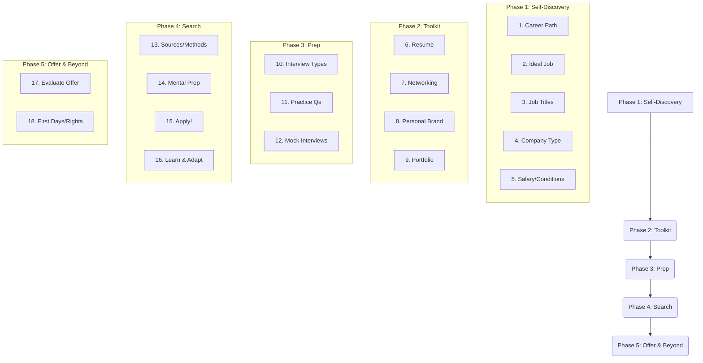

# The philosophy of Job Hunting

Finding the right job can feel like a big journey, but breaking it down into manageable steps makes it much less scary. This guide is designed to walk you through the process, offering details and practical advice along the way. Remember, job hunting is dynamic and different for each person, and it's okay to revisit steps or adjust your course as you learn more about yourself and the market (even if it means starting over from the self-discovery phase when you already prepared for a whole different career path).

To simplify and optimize things, I have devided the job hunt into key phases. In each phase there are steps that contain:
 - A **short description** to set the stage.
 - **Main points and tips** to guide your strategy.
 - **Guiding questions** to spark self-reflection and clarify your goals.
 - **Action items** to give you concrete next steps.

Before we get started, here is the big picture of the job hunt journey:

**The Job Hunting Journey:**

**Phase 1: Self-Discovery & Goal Setting**

1.  Understanding Your Career Path
2.  Defining Your Ideal Current Job
3.  Identifying Target Job Titles
4.  Choosing Your Preferred Company Type & Culture
5.  Determining Your Work Conditions & Salary Expectations

**Phase 2: Building Your Professional Toolkit**

6.  Crafting Your Resume(s)
7.  Leveraging Your Network
8.  Building Your Personal Brand (e.g., LinkedIn)
9.  Showcasing Your Work (e.g., Portfolio/GitHub)

**Phase 3: Interview Preparation**

10. Understanding Interview Types & Common Questions
11. Practicing Interview Questions
12. Simulating Interview Scenarios

**Phase 4: The Active Job Search**

13. Identifying Job Sources & Application Methods
14. Preparing for All Outcomes
15. Starting the Application Process
16. Learning & Adapting from Each Application

**Phase 5: Sealing the Deal & Beyond**

17. Evaluating and Negotiating the Offer
18. Understanding Your New Workplace & Rights


*Feel free to loop back. It's natural to feel doubt or want to explore different paths. You might revisit earlier steps as you learn more – that's perfectly okay and part of the process.*

---

## Phase 1: Self-Discovery & Goal Setting

### 1. Understanding Your Career Path

Figuring out your long-term career path is a big first step, but it provides crucial direction for your entire job search. Think about the bigger picture of where you want to go professionally.

**Main Points & Tips:**
*   Don't feel pressured to have it all figured out immediately. Focus on what feels right *now* and the general direction you want to head.
*   Research different careers that interest you. Talk to people already in those fields.
*   Consider your values: What's truly important to you in a career (e.g., impact, creativity, stability, learning)?

**Guiding Questions:**
*   What kind of work genuinely excites or interests me?
*   What activities make me lose track of time?
*   What problems do I enjoy solving?
*   What does my ideal workday look like? What activities fill it?
*   What are the typical advancement opportunities in careers that interest me? What does that progression look like?
*   What skills do I enjoy using or want to develop?

**Action Items:**
1.  Brainstorm potential career fields that align with your interests and values.
2.  Research 2-3 potential career paths: read articles, watch "day in the life" videos, look at job descriptions.
3.  Try to connect with at least one person in a field that interests you for an informational interview. Ask them about their path, daily tasks, and the pros/cons.
    Here is an example of a message you can send to that person:
    "Hey <name>, I'm currently trying to decide what I want to do in life and I saw that you are a <job-description>. Would you like to chat really quick about your day to day? I would really appriciate it :)"

### 2. Defining Your Ideal Current Job

With a potential career path in mind, let's narrow down the *specific type* of job you're looking for right now. This depends on your current skills, experience level, and what roles realistically bridge the gap between where you are and where you want to go.

**Main Points & Tips:**
*   Be realistic about entry points. Sometimes you need a stepping-stone role.
*   Consider acquiring new skills through courses, certifications, or personal projects if needed to qualify for desired roles.
*   Think about the *function* you want to perform (e.g., building software, managing projects, analyzing data, interacting with clients).

**Guiding Questions:**
*   Based on my career path exploration, what specific roles seem like a good fit *for my next step*?
*   What skills and experiences do I currently possess that are relevant to these roles?
*   Are there skill gaps I need to address? How can I address them (e.g., online course, volunteer project, certification)?
*   What level of responsibility am I seeking (e.g., individual contributor, team lead)?

**Action Items:**
1.  List 3-5 specific job types that align with your Step 1 findings and current capabilities.
2.  For each job type, list the core responsibilities and required skills based on sample job descriptions.
3.  Identify any key skill gaps and brainstorm ways to fill them.

### 3. Identifying Target Job Titles

Job titles can be inconsistent across companies. Researching common titles helps you understand the landscape and use the right keywords in your search and on your resume.

**Main Points & Tips:**
*   Look at job boards (LinkedIn, Indeed, company career pages) within your target fields. Note the common titles used for roles that match your desired responsibilities (from Step 2).
*   Understand variations (e.g., "Software Engineer" vs. "Software Developer," "Project Manager" vs. "Program Manager").
*   Pay attention to level indicators (e.g., Junior, Senior, Lead, Staff).

**Guiding Questions:**
*   What specific job titles consistently appear for the types of roles I identified in Step 2?
*   Are there variations in titles for similar roles across different types of companies (e.g., startup vs. large corporation)?
*   What level (Junior, Mid-level, Senior, etc.) do I realistically qualify for right now?

**Action Items:**
1.  Compile a list of relevant job titles based on your research.
2.  Note any keywords related to skills, technologies, or responsibilities often associated with these titles in job descriptions.

### 4. Choosing Your Preferred Company Type & Culture

Where you work is as important as what you do. Consider the environment that will help you thrive.

**Main Points & Tips:**
*   Think about size: Large corporations often offer structure and resources, while startups might offer faster pace and broader roles. Medium-sized companies can be a blend.
*   Consider industry: What field does the company operate in? Does it align with your interests or values?
*   Research company culture: Look at their website (About Us, Careers pages), reviews (Glassdoor), and LinkedIn presence. What vibe do you get?

**Guiding Questions:**
*   Do I prefer a structured environment or a more flexible, fast-paced one?
*   How important is company size to me? What are the pros and cons of large vs. small companies for *me*?
*   What kind of company mission or industry excites me?
*   What values are important to me in a workplace (e.g., collaboration, work-life balance, innovation, diversity)?

**Action Items:**
1.  Define your preferences regarding company size, industry, and culture.
2.  Start identifying a few specific companies that seem to fit these preferences.

### 5. Determining Your Work Conditions & Salary Expectations

Be clear about your needs regarding work arrangements and compensation.

**Main Points & Tips:**
*   Research typical salary ranges for your target roles, experience level, and geographic location (use sites like Glassdoor, Levels.fyi, Payscale).
*   Consider your *total compensation* package: salary, bonus potential, benefits (health, retirement), paid time off, perks.
*   Think about logistics: Remote, hybrid, or in-office? Commute time? Travel requirements?

**Guiding Questions:**
*   What is my minimum acceptable salary based on my budget and market research?
*   What is my desired salary range?
*   What benefits are most important to me (e.g., health insurance, retirement plan, parental leave)?
*   What are my preferences for remote, hybrid, or in-office work?
*   How much commuting am I willing to do?

**Action Items:**
1.  Research and determine a realistic salary range for your target roles and location.
2.  List your non-negotiable requirements and nice-to-haves regarding benefits and work conditions.

---

## Phase 2: Building Your Professional Toolkit

### 6. Crafting Your Resume(s)

Your resume is often the first impression you make. It needs to be clear, concise, and tailored to the jobs you're applying for.

**Main Points & Tips:**
*   **Tailor for Each Job:** Create a master resume, but customize it for each specific application. Highlight the skills and experiences most relevant to *that* job description.
*   **Use Keywords:** Incorporate keywords from the job description naturally throughout your resume. Applicant Tracking Systems (ATS) often scan for these.
*   **Quantify Achievements:** Whenever possible, use numbers to show your impact (e.g., "Increased efficiency by 15%," "Managed a budget of $X," "Led a team of Y").
*   **Focus on Results:** Frame your experience around accomplishments, not just duties. Use action verbs.
*   **Keep it Concise:** Aim for one page, especially if you have less than 10 years of experience. Two pages is acceptable for more senior roles.
*   **Format for Readability:** Use clear headings, bullet points, and consistent formatting (font, size). Ensure there's enough white space. A clean, visually appealing resume is easier to scan quickly.
*   **Proofread Meticulously:** Typos and grammatical errors can sink your application. Get a second pair of eyes if possible.
*   **Consider Tools:** Tools like Rezi, Teal, or resume builders in Canva/Word can help with formatting, but content is king.

**Guiding Questions:**
*   Does my resume clearly highlight the skills and experiences relevant to my target roles (from Phase 1)?
*   Have I used keywords from typical job descriptions for these roles?
*   Have I quantified my accomplishments where possible?
*   Is my resume easy to read, well-formatted, and free of errors?
*   Do I need different versions of my resume for slightly different types of roles?

**Action Items:**
1.  Create or update your master resume.
2.  Identify 2-3 target job descriptions and practice tailoring your resume for each.
3.  Ask a trusted friend, mentor, or career advisor to review your resume for clarity and impact.

### 7. Leveraging Your Network

Networking is incredibly powerful. Many jobs are filled through referrals before they're even publicly posted.

**Main Points & Tips:**
*   **Informational Interviews:** Reach out to people in roles or companies that interest you. Ask about their experiences, not for a job directly. Most people are happy to share insights.
*   **LinkedIn:** Connect strategically with people in your field, recruiters, and alumni from your school. Engage with content, share updates.
*   **Events & Conferences:** Attend industry events (online or in-person) to learn and meet people.
*   **Existing Contacts:** Don't underestimate your current network – friends, family, former colleagues, classmates. Let them know you're looking and what you're looking for.
*   **Give Before You Get:** Networking is reciprocal. Offer help, share interesting articles, make introductions for others.

**Guiding Questions:**
*   Who do I already know in my target industry or companies?
*   How can I strategically expand my network on platforms like LinkedIn?
*   Are there industry events or meetups I could attend?
*   How can I approach networking authentically and build genuine connections?

**Action Items:**
1.  Update your LinkedIn profile (see Step 8).
2.  Make a list of people you know who might be helpful connections. Reach out to a few.
3.  Identify 3-5 new people you'd like to connect with for informational interviews and send personalized connection requests or messages.
4.  Research relevant online groups or upcoming events (there are lots of groups and communities in platforms such as Facebook and WhatsApp).

### 8. Building Your Personal Brand (e.g., LinkedIn)

Your online presence matters. Recruiters *will* look you up. Ensure your digital footprint presents you professionally.

**Main Points & Tips:**
*   **Optimize LinkedIn:** Use a professional photo, write a compelling headline and summary, detail your experience (mirroring your resume but potentially more conversational), request recommendations, list relevant skills.
*   **Engage Professionally:** Share relevant articles, comment thoughtfully on posts, join industry groups.
*   **Consistency:** Ensure your brand message is consistent across platforms (LinkedIn, portfolio, resume).
*   **Clean Up Other Social Media:** Review privacy settings on personal accounts (Facebook, Instagram, etc.) or ensure public content is professional.

**Guiding Questions:**
*   What message do I want my online presence to convey about my skills and professional interests?
*   Is my LinkedIn profile complete, professional, and optimized with keywords?
*   Does my online activity reflect positively on me as a potential employee?

**Action Items:**
1.  Thoroughly review and update your LinkedIn profile.
2.  Search for yourself online to see what recruiters might find.
3.  Review privacy settings on personal social media accounts.

### 9. Showcasing Your Work (e.g., Portfolio/GitHub)

For many roles (especially creative or technical ones), showing your work is more impactful than just describing it.

**Main Points & Tips:**
*   **GitHub (for technical roles):** Keep your profile active. Showcase personal projects, contributions to open source. Ensure your code is clean and well-documented. Include a README for projects.
*   **Portfolio Website (for creative/design/writing roles):** Use platforms like Behance, Dribbble, Adobe Portfolio, or build a simple site (Carrd, Wix, Squarespace). Showcase your best work with brief descriptions of the project, your role, and the outcome.
*   **Selectivity:** Quality over quantity. Only include your strongest, most relevant work.
*   **Link It:** Include links to your GitHub or portfolio on your resume and LinkedIn.
*   **(Optional) Create a Tailored Project:** If you have the time and inclination, consider creating a small project specifically designed to showcase skills relevant to your most desired roles. This can be particularly impactful if your existing portfolio has gaps.

**Guiding Questions:**
*   What tangible examples of my skills and work can I showcase?
*   Which platform is most appropriate for my field (GitHub, online portfolio, etc.)?
*   Which projects best demonstrate the skills required for my target roles?
*   Is my showcased work well-presented and easy to understand?

**Action Items:**
1.  Identify 3-5 key projects or pieces of work to showcase.
2.  Set up or update your GitHub profile or portfolio website.
3.  Ensure links are included on your resume and LinkedIn.

---

## Phase 3: Interview Preparation

### 10. Understanding Interview Types & Common Questions

Interviews vary. Knowing what to expect helps you prepare effectively.

**Main Points & Tips:**
*   **Common Stages:** Screening call (HR/recruiter), technical interview, behavioral interview (STAR method), panel interview, take-home assignment, final round (often with hiring manager or senior leadership).
*   **Screening Call:** Focuses on your background, interest in the role, salary expectations, logistics.
*   **Technical Interview:** Tests specific skills (coding challenges, system design, problem-solving relevant to the role).
*   **Behavioral Interview:** Assesses soft skills, work style, and how you handle situations. Uses questions like "Tell me about a time when..." Prepare using the STAR method (Situation, Task, Action, Result).
*   **Research the Company's Process:** Sometimes companies or recruiters outline their interview process. Check Glassdoor for interview reviews for the specific company.

**Guiding Questions:**
*   What are the typical interview stages for the roles I'm targeting?
*   What kinds of technical skills might be tested?
*   What are common behavioral questions, and how can I prepare STAR examples for them? (e.g., teamwork, conflict, failure, success, initiative)

**Action Items:**
1.  Research the typical interview process for your target roles and companies.
2.  Make a list of common behavioral questions and brainstorm specific examples from your experience using the STAR method.
3.  Identify potential technical topics or question types you might encounter.

### 11. Practicing Interview Questions

Practice helps you articulate your thoughts clearly and confidently.

**Main Points & Tips:**
*   **Practice Out Loud:** Don't just think about answers, say them. Record yourself or practice with a friend.
*   **Refine STAR Stories:** Ensure your behavioral examples are concise, specific, and clearly demonstrate the desired skill or trait.
*   **Technical Practice:** Work through coding problems (LeetCode, HackerRank), system design scenarios, or other relevant technical exercises.
*   **"Tell Me About Yourself":** Prepare a concise (60-90 second) overview highlighting your relevant background, key skills, and interest in the role.
*   **Prepare Your Questions:** Always have thoughtful questions ready to ask the interviewer about the role, team, company, or culture. This shows engagement.

**Guiding Questions:**
*   Can I clearly articulate my key skills and experiences?
*   Are my STAR examples compelling and easy to follow?
*   Am I comfortable explaining my technical thought process?
*   What questions do I genuinely have about this role/team/company?

**Action Items:**
1.  Write out and practice your "Tell me about yourself" pitch.
2.  Write out detailed STAR examples for common behavioral questions. Practice delivering them.
3.  Dedicate time to technical practice if relevant to your roles.
4.  Compile a list of insightful questions to ask interviewers.

### 12. Simulating Interview Scenarios

Mimicking the real thing reduces anxiety and highlights areas for improvement.

**Main Points & Tips:**
*   **Mock Interviews:** Ask a friend, mentor, or career coach to conduct a mock interview. Use platforms like Pramp for technical mock interviews.
*   **Get Feedback:** Ask your mock interviewer for specific, constructive feedback on your answers, delivery, and body language.
*   **Time Yourself:** Practice answering questions concisely.
*   **Simulate the Environment:** If it's a video interview, practice in the space you'll use, check your background, lighting, and internet connection.

**Guiding Questions:**
*   Where can I improve in my delivery or the content of my answers?
*   Am I answering questions concisely?
*   How comfortable do I feel under pressure?
*   Is my technical setup ready for video interviews?

**Action Items:**
1.  Schedule at least one mock interview with someone you trust.
2.  Actively solicit and reflect on the feedback received.
3.  Test your tech setup (camera, microphone, internet) if preparing for remote interviews.

---

## Phase 4: The Active Job Search

### 13. Identifying Job Sources & Application Methods

Cast a wide but targeted net. Know where to look and the best ways to apply.

**Main Points & Tips:**
*   **Job Boards:** LinkedIn, Indeed, Glassdoor, specialized niche boards (e.g., Otta, Wellfound for tech).
*   **Company Careers Pages:** Many companies prioritize candidates who apply directly. Make it a habit to check the websites of companies you're interested in.
*   **Networking/Referrals:** Often the most effective method. Leverage the connections you built in Phase 2. Ask for introductions or if they know of openings.
*   **Recruiters:** Connect with recruiters specializing in your field.
*   **Conferences/Events:** Job opportunities are often shared or discovered at industry gatherings.
*   **News & Blogs:** Follow industry news sites and blogs. They often report on company growth, funding rounds, or new initiatives, which can highlight potential employers you might not have considered.

**Guiding Questions:**
*   Which job boards are most relevant for my industry and target roles?
*   Which companies will I monitor directly via their career pages?
*   Who in my network can I reach out to regarding potential opportunities or referrals?
*   Are there specialized recruiters I should connect with?

**Action Items:**
1.  Bookmark your preferred job boards and company career pages.
2.  Set up job alerts based on your target titles and keywords.
3.  Revisit your network list and identify people to contact specifically about job searching.

### 14. Preparing for All Outcomes

Job searching has ups and downs, and can definitely be repetitive. Understanding potential outcomes and preparing for them (both physically and mentally) helps you stay resilient and efficient.

**Main Points & Tips:**
*   **Expect Various Outcomes:** You'll encounter rejections, interview requests, offers, and sometimes, silence. Each is a data point, not a judgment of your worth.
*   **Focus on the Process:** Concentrate on controllable factors: quality applications, thorough preparation, networking efforts.
*   **Prepare Generic Responses:** Draft template messages for common scenarios (thank you after interview, follow-up if no response, response to rejection, accepting/declining offer). This saves time and mental energy.
*   **Stay Organized:** Track applications, stages, contacts, and feedback (a spreadsheet or tool like Teal is useful).
*   **Analyze Feedback:** If you receive feedback (especially after rejection), review it objectively. Does it align with other feedback? Are there actionable steps you can take? Use it to refine your approach, but don't dwell on feedback you disagree with.
*   **Celebrate Small Wins:** Landing an interview, getting positive feedback, making a good connection – acknowledge these to maintain motivation.
*   **Maintain Routine & Self-Care:** Job searching is taxing. Stick to healthy routines (sleep, exercise, hobbies) to avoid burnout.

**Potential Outcomes & Follow-ups:**
*   **Rejection:** It's common. Send a polite thank-you note if you interviewed, optionally asking for feedback (see Step 16). Use any feedback constructively.
*   **Interview Request:** Respond promptly, confirm details, mark your calendar, and prepare thoroughly (revisit Phase 3). Ensure a suitable environment for calls/video interviews.
*   **Offer:** Congratulations! Take time to evaluate, get it in writing, and prepare to negotiate if necessary (see Step 17).
*   **Silence (No Response):** After a reasonable time (e.g., 1-2 weeks post-application, or after the stated follow-up date post-interview), consider sending a polite follow-up inquiry. Check your tracker for contact details.

**Guiding Questions:**
*   How will I handle different outcomes constructively?
*   What template messages can I prepare now?
*   What system will I use to track applications, feedback, and progress?
*   How will I integrate self-care into my job search routine?

**Action Items:**
1.  Set up your application tracking system.
2.  Draft template messages for follow-ups, thank you notes, and responses to rejection/offers.
3.  Plan how you will incorporate self-care activities into your routine.
4.  Decide how you will process and potentially act on feedback received during the process.

### 15. Starting the Application Process

Time to put your preparation into action! Apply strategically.

**Main Points & Tips:**
*   **Quality over Quantity:** Don't just spam applications. Focus on roles that are a genuine fit and where you've tailored your materials.
*   **Pre-Application Checklist (for each role):**
    *   **Read about the Company/Product:** Understand what they do. Check your network for connections. *Referrals are very valuable.*
    *   **Research the Team (if possible):** Look up potential team members on LinkedIn. What's their background? What technologies do they mention? This helps tailor your application and prepare interview questions.
    *   **Analyze the Job Description:** Read the responsibilities and required skills carefully. *Do you genuinely want this job? Can you see yourself doing it?*
    *   **Self-Assessment:** Would *you* hire yourself for this role based on your current application materials?
    *   **Optimize Materials:** Ensure your resume and cover letter (if applicable) are tailored specifically for *this* job, using keywords from the description.
*   **Note Your Feelings:** As you research the company, team, and role, pay attention to your gut feelings and any fears or concerns that arise. Write them down. These can become valuable questions to ask during interviews ("I noticed the team primarily uses X technology, which I'm less familiar with. How is onboarding handled for new technologies?") or points for self-reflection (*"Am I hesitant because I doubt my skills, or is there a genuine mismatch in culture?"*).
*   **Track Everything:** Log the job, company, date applied, materials used, and any contacts in your tracking system.

**Guiding Questions (before applying):**
*   Is this role a good fit for my skills, interests, and goals (from Phase 1)?
*   Would I hire myself for this job?
*   Have I tailored my resume/cover letter specifically for this opportunity?
*   Do I know anyone at the company who could provide a referral or insight?
*   Have I noted this application in my tracking system?

**Action Items:**
1.  Set a realistic goal for applications per week (e.g., 5-10 high-quality applications rather than 50 generic ones).
2.  Start applying to roles that fit your criteria, following your pre-application checklist.
3.  Diligently update your tracking system.

### 16. Learning & Adapting from Each Application

Every application and interview is a learning opportunity.

**Main Points & Tips:**
*   **Track Outcomes:** Note the result of each application (no response, rejection, interview, offer). Look for patterns.
*   **Analyze Interviews:** After each interview, jot down the questions asked, how you felt you answered, and anything you learned about the role or company. What went well? What could be improved?
*   **Ask for Feedback (Politely):** If rejected after an interview, it's okay to send a thank-you note and politely ask if they have any feedback to help your search. Don't expect a response, but it's worth asking.
    *   **Example Rejection Follow-up:**
        ```
        Subject: Following Up - [Your Name] - [Job Title] Interview

        Dear [Interviewer Name/Hiring Manager Name],

        Thank you again for taking the time to speak with me about the [Job Title] position last [Day/Date]. I really enjoyed learning more about the opportunity and the team at [Company Name].

        While I'm disappointed to hear I wasn't selected, I respect your decision. If you have a moment and are willing, I would be very grateful for any brief feedback you might be able to share about my application or interview that could help me improve in my job search.

        Thank you for your consideration. I wish you and the team all the best in finding the right candidate.

        Sincerely,
        [Your Name]
        [Link to LinkedIn Profile (Optional)]
        ```
*   **Adapt Your Strategy:** Based on feedback and observed patterns (e.g., not getting interviews might mean resume issues; failing technical screens might mean more technical practice needed), adjust your approach. Maybe you need to tweak your resume, practice different interview questions, or target slightly different roles.
*   **Visualize Progress:** Consider using a simple visual tracker ([i-applied-to-500-jobs-in-3-months-this-is-what-i-learned-v0-8p1zkwouqhse1.webp]) if it helps you see the overall flow and identify bottlenecks.

**Guiding Questions:**
*   What patterns am I seeing in the responses (or lack thereof) to my applications?
*   What feedback (direct or indirect) have I received from interviews?
*   Based on this, what specific changes can I make to my resume, cover letter, interview preparation, or application strategy?

**Action Items:**
1.  Consistently update your tracker with application outcomes.
2.  After each interview, take 5-10 minutes to debrief and note down key takeaways.
3.  If rejected post-interview, consider sending a polite feedback request.
4.  Periodically (e.g., weekly) review your progress and identify areas for adaptation.

---

## Phase 5: Sealing the Deal & Beyond

### 17. Evaluating and Negotiating the Offer

Congratulations, you got an offer! Now, ensure it's the right fit and advocate for yourself.

**Main Points & Tips:**
*   **Get it in Writing:** Ensure you receive the full offer details (salary, bonus, benefits, start date, etc.) in a formal written document.
*   **Take Time to Evaluate:** Don't feel pressured to accept immediately. Ask for a reasonable timeframe (e.g., 24-72 hours) to review it.
*   **Compare to Your Needs:** Revisit your salary research and requirements (from Step 5). Does the offer meet your expectations and needs? Consider the *entire* package.
*   **Negotiation is Normal:** It's often expected. Be polite, professional, and base your request on research and your value. Focus on your target salary range, but be prepared to discuss other elements like signing bonuses, vacation time, or professional development budgets if salary is firm.
*   **Know Your Bottom Line:** Decide beforehand what your minimum acceptable terms are.

**Guiding Questions:**
*   Does this offer align with the salary range I researched and my personal budget?
*   How does the complete compensation package (salary, bonus, benefits, perks) compare to my expectations?
*   Does the role, team, and company culture still feel like the right fit after the interview process?
*   Are there any aspects I'd like to negotiate? What is my strategy?

**Action Items:**
1.  Carefully review the written offer details.
2.  Compare the offer against your requirements (Step 5) and market research.
3.  If negotiating, prepare your points based on research and value. Practice your delivery.
4.  Once satisfied, formally accept the offer in writing.

### 18. Understanding Your New Workplace & Rights

You've signed! Prepare for a smooth start.

**Main Points & Tips:**
*   **Onboarding:** Understand the company's onboarding process. What paperwork is needed? What's the schedule for the first few days/weeks?
*   **Understand the Culture:** Observe team dynamics, communication styles, and unspoken rules during your initial weeks.
*   **Know Your Rights:** Familiarize yourself with company policies (employee handbook) and basic employment laws regarding things like working hours, breaks, leave, and anti-discrimination.
*   **Set Expectations:** Have early conversations with your manager about expectations for your role, performance metrics, and communication preferences.
*   **Continue Networking:** Build relationships with your new colleagues.

**Guiding Questions:**
*   What do I need to do before my first day?
*   What are the key company policies I should be aware of?
*   What are my manager's expectations for my first 30-60-90 days?
*   Who are the key people I should connect with in my first few weeks?

**Action Items:**
1.  Complete any pre-employment requirements.
2.  Review the employee handbook or company policy documents.
3.  Prepare questions for your manager about expectations and onboarding.
4.  Be proactive in introducing yourself and building relationships.

---

Job hunting is a journey of discovery, persistence, and growth. Be patient with yourself, celebrate your progress, and remember that the right opportunity is out there. Good luck!

---

# Sources

*(Keep relevant sources, ensure they are properly cited if directly quoting or using specific data)*
1. https://www.reddit.com/r/jobsearchhacks/comments/1jq0ncn/i_applied_to_500_jobs_in_3_months_this_is_what_i/
2. https://www.indeed.com/career-advice/finding-a-job/best-ways-to-find-a-job
3. https://hbr.org/2021/03/a-five-week-guide-to-getting-a-job
4. https://www.businessnewsdaily.com/9358-digital-job-search-guide.html
*(Add any other sources you consulted)*